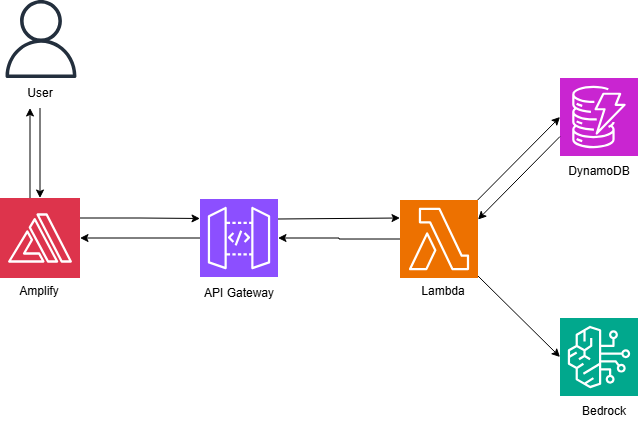
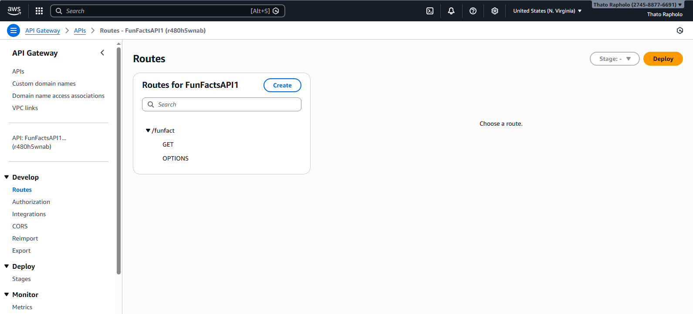
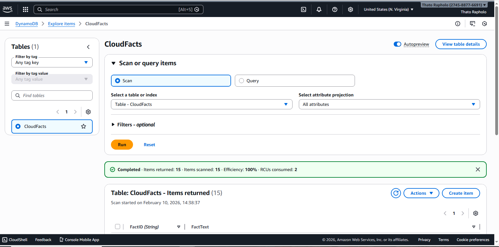
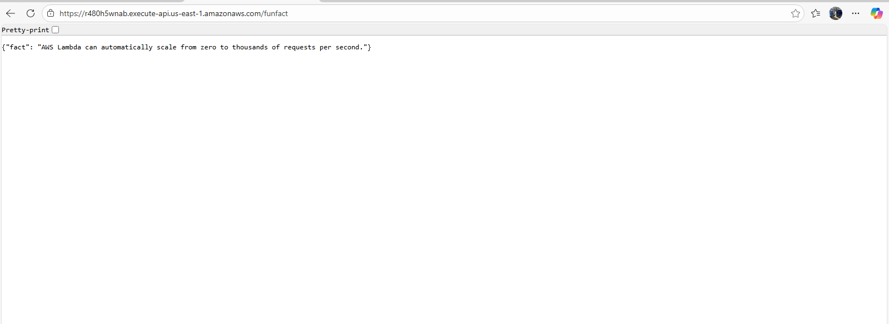

# Cloud Fun Facts Generator ☁️

A serverless web application that generates interesting cloud computing facts using AWS services. Built to demonstrate modern cloud architecture and CI/CD practices.

## Live Demo

**AWS Amplify**: `https://production.d23i30swef349m.amplifyapp.com/` *(currently paused for cost management)*

## Screenshots

### Application Interface


### AWS Architecture


<details>
<summary>📷 View More Infrastructure Screenshots</summary>


*API Gateway with GET and OPTIONS methods*


*DynamoDB table with 15 cloud facts*


*Lambda function with API Gateway integration*


*IAM role with Bedrock, Lambda, and DynamoDB access*


*Live API test showing successful response*

</details>

## Architecture

**Serverless Stack:**
- **Frontend**: HTML/CSS/JS hosted on AWS Amplify
- **API**: Amazon API Gateway (REST API)
- **Compute**: AWS Lambda (Python)
- **Database**: Amazon DynamoDB (15 cloud facts)
- **AI**: Amazon Bedrock (optional fact generation)
- **CI/CD**: AWS Amplify (GitHub integration)

**Request Flow:**
```
User → Amplify (CDN) → API Gateway → Lambda → DynamoDB/Bedrock
```

## Quick Start

### Prerequisites
- AWS Account
- GitHub Account
- AWS CLI (optional)

### Setup

**1. Backend Setup**

```bash
# Create DynamoDB table
aws dynamodb create-table \
    --table-name CloudFacts \
    --attribute-definitions AttributeName=FactID,AttributeType=S \
    --key-schema AttributeName=FactID,KeyType=HASH \
    --billing-mode PAY_PER_REQUEST

# Create Lambda function
# - Runtime: Python 3.12
# - Handler: lambda_function.lambda_handler
# - IAM Role: AmazonBedrockFullAccess, AWSLambdaBasicExecutionRole, DynamoDB read

# Create API Gateway
# - REST API with /funfact resource
# - GET method → Lambda integration
# - Enable CORS
```

**2. Frontend Deployment with AWS Amplify**

```bash
# Push your code to GitHub
git clone <your-repo>
cd <your-repo>

# Ensure website files are in website-files/ folder
# - index.html
# - script.js  (with API endpoint configured)
# - style.css

git add .
git commit -m "Initial commit"
git push
```

**3. Connect to AWS Amplify**
1. Go to AWS Amplify Console
2. Click "New app" → "Host web app"
3. Connect to GitHub and select your repository
4. Branch: `main` or `production`
5. Build settings (auto-detected):
   ```yaml
   version: 1
   frontend:
     phases:
       build:
         commands:
           - echo "Deploying static site"
     artifacts:
       baseDirectory: /website-files
       files:
         - '**/*'
   ```
6. Deploy! Amplify will provide a URL like: `https://xxxxx.amplifyapp.com`

**Benefits of Amplify:**
- Automatic HTTPS/SSL
- Global CDN distribution
- Continuous deployment on every push
- Preview deployments for pull requests
- Built-in monitoring

## Project Structure

```
.
├── website-files/
│   ├── index.html          # Frontend UI
│   ├── script.js           # API calls
│   ├── style.css           # Styling
│   └── screenshots/        # Documentation images
└── README.md
```

## Lambda Function

<details>
<summary>View Complete Code</summary>

```python
import boto3
import random
import json


# DynamoDB connection
dynamodb = boto3.resource("dynamodb")
table = dynamodb.Table("CloudFacts")


# Bedrock client
bedrock = boto3.client("bedrock-runtime")


def lambda_handler(event, context):
    # Fetch all facts from DynamoDB
    response = table.scan()
    items = response.get("Items", [])
    if not items:
        return {
            "statusCode": 200,
            "headers": {
                "Content-Type": "application/json",
                "Access-Control-Allow-Origin": "*",
                "Access-Control-Allow-Methods": "GET, OPTIONS",
                "Access-Control-Allow-Headers": "Content-Type"
            },
            "body": json.dumps({"fact": "No facts available in DynamoDB."})
        }


    fact = random.choice(items)["FactText"]


    # Messages for Claude 3.5 Haiku
    messages = [
        {
            "role": "user",
            "content": f"Take this cloud computing fact and make it fun and engaging in 1-2 sentences maximum. Keep it short and witty: {fact}"
        }
    ]


    body = {
        "anthropic_version": "bedrock-2023-05-31",
        "max_tokens": 100,
        "messages": messages,
        "temperature": 0.7
    }


    try:
        # Call Claude 3.5 Haiku on Bedrock
        resp = bedrock.invoke_model(
            modelId="anthropic.claude-3-5-sonnet-20240620-v1:0",
            body=json.dumps(body),
            accept="application/json",
            contentType="application/json"
        )


        # Parse response
        result = json.loads(resp["body"].read())
        witty_fact = ""


        # Claude v3 response: look inside "content"
        if "content" in result and result["content"]:
            for block in result["content"]:
                if block.get("type") == "text":
                    witty_fact = block["text"].strip()
                    break


        # Fallback if empty or too long
        if not witty_fact or len(witty_fact) > 300:
            witty_fact = fact


    except Exception as e:
        print(f"Bedrock error: {e}")
        witty_fact = fact


    return {
        "statusCode": 200,
        "headers": {
            "Content-Type": "application/json",
            "Access-Control-Allow-Origin": "*",
            "Access-Control-Allow-Methods": "GET, OPTIONS",
            "Access-Control-Allow-Headers": "Content-Type"
        },
        "body": json.dumps({"fact": witty_fact})
    }
```

</details>

## Configuration

### API Endpoint
```
https://r480h5wnab.execute-api.us-east-1.amazonaws.com/funfact
```

### IAM Permissions Required
- **Lambda Role**: `CloudFunFacts-role-2nyi87qj`
  - `AmazonBedrockFullAccess`
  - `AWSLambdaBasicExecutionRole`
  - `DynamoDBCloudFactsRead` (inline policy)

### DynamoDB Schema
```
Table: CloudFacts
Partition Key: FactID (String)
Attributes: FactText (String)
Capacity: On-demand
Items: 15 facts
```

## Troubleshooting

### Changes not appearing after push
- Check Amplify build logs in the console
- Verify GitHub branch is correct (`production` or `main`)
- Ensure `baseDirectory: /website-files` in build settings
- Clear browser cache (Ctrl+Shift+R)
- Check build succeeded (green checkmark in Amplify)

### Amplify build fails
- Review build logs in Amplify console
- Verify all files exist in `website-files/` folder
- Check that files are committed and pushed to GitHub

### CORS errors in browser
```python
# Ensure Lambda returns these headers:
'Access-Control-Allow-Origin': '*'
'Access-Control-Allow-Headers': 'Content-Type,X-Amz-Date,Authorization'
'Access-Control-Allow-Methods': 'GET,OPTIONS'
```

### Lambda timeout
- Increase timeout to 30 seconds
- Check DynamoDB table exists
- Verify IAM permissions

## Cost Estimate

| Service | Monthly Cost (1000 requests) |
|---------|------------------------------|
| AWS Amplify | ~$5-10 (hosting + build minutes) |
| Lambda | Free tier |
| API Gateway | Free tier |
| DynamoDB | Free tier |
| Bedrock (optional) | ~$3-5 |
| **Total** | **~$8-15/month** |

**Cost Optimization:**
- Paused Amplify deployment when not actively demoing
- Using on-demand DynamoDB (no idle costs)
- Lambda free tier covers 1M requests/month

## Skills Demonstrated

- Serverless architecture design
- AWS Lambda (Python)
- API Gateway configuration
- DynamoDB NoSQL database
- Amazon Bedrock AI integration
- AWS Amplify deployment
- CI/CD with GitHub integration
- IAM security & permissions
- CORS configuration
- Frontend development
- Cost optimization strategies

## Future Enhancements

- [ ] User authentication (Cognito)
- [ ] Fact categories/filtering
- [ ] Social media sharing
- [ ] Dark mode
- [ ] Infrastructure as Code (Terraform)
- [ ] Automated testing


## License

This is a portfolio/learning project. Feel free to use as inspiration for your own projects.

---

**Built with ☁️ by Thato Rapholo**  
*Demonstrating serverless architecture and modern cloud engineering practices*

